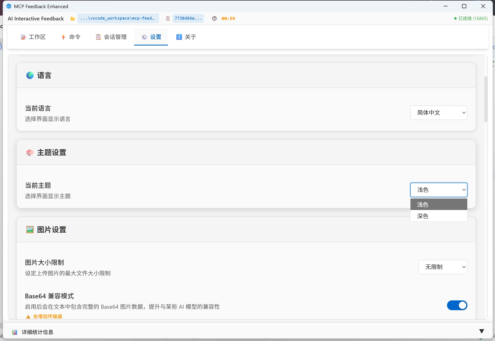
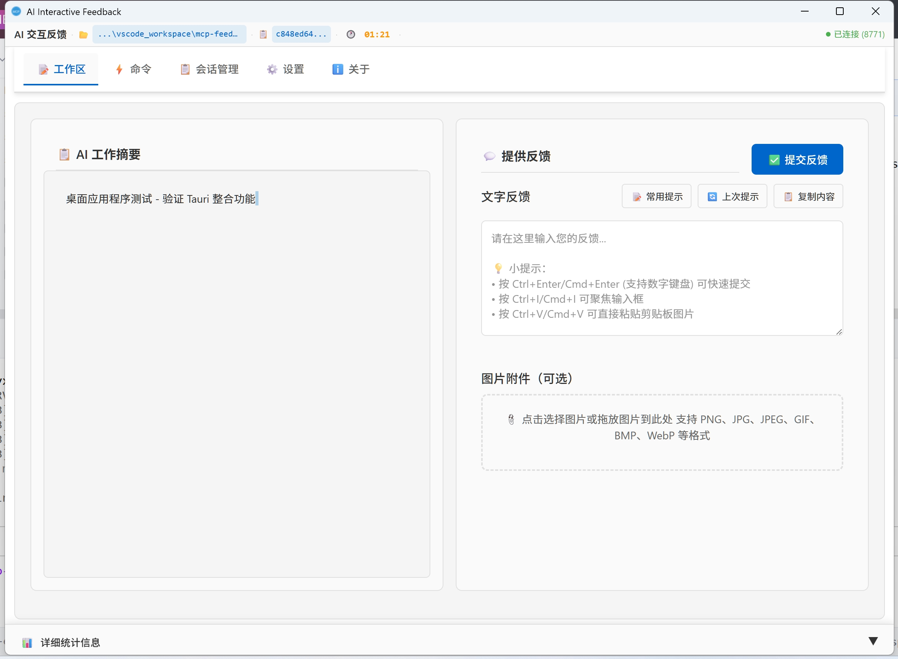

# MCP Feedback Enhanced

原项目：https://github.com/Minidoracat/mcp-feedback-enhanced

本项目分支只修改了UI界面、用户交互体验、默认简体中文等，无任何新功能的增减

## 主要改进

### 版本 2025.0720.06 更新内容

#### 🖥️ 桌面应用完善优化
- **窗口标题修复**：桌面应用标题正确显示为"AI Interactive Feedback"
- **窗口尺寸优化**：窗口高度精确占用工作区域97%（自动排除任务栏），宽度为屏幕90%
- **内容显示完整**：确保所有UI元素包括底部详细信息区域都能完整显示
- **代码简体中文化**：Rust代码中的所有繁体中文注释和字符串统一改为简体中文

### 版本 2025.0720.05 更新内容

#### 📝 文档优化
- **配图完善**：README.md中的功能展示图片已正确引用
- **路径修正**：统一图片资源路径为docs/zh-CN/images目录

### 版本 2025.0720.03 更新内容

#### 🖥️ 桌面应用窗口优化
- **智能窗口尺寸**：高度自动填满屏幕，宽度保持合理比例
- **居中显示**：窗口默认在屏幕中央显示，提供更好的视觉体验
- **标题统一**：应用标题统一更改为"AI Interactive Feedback"

### 版本 2025.0719.01 更新内容

### 🎨 主题切换功能
- **默认浅色主题**：提供更清爽的视觉体验
- **主题切换**：支持浅色/深色主题自由切换



### 🖥️ 工作区交互体验优化
- **水平布局模式虾左右分离滑动**：左右布局区域可以独立滑动，提升操作便利性



### 🔗 连接状态显示增强
- **端口号显示**：右上角连接状态区域增加端口号显示
- **状态一目了然**：快速识别当前连接的端口信息

### ⏱️ 实时交互计时
- **菜单栏计时显示**：菜单栏实时显示交互正计时
- **时间跟踪**：帮助用户了解当前交互会话的持续时间

## 使用方式

### 1. 安装
```bash
# 安装 uv（如果尚未安装）
pip install uv
```

### 2. 配置 MCP
在您的 MCP 配置文件中添加以下配置：

**推荐配置**（桌面应用模式，默认简体中文）：
```json
{
  "mcpServers": {
    "ai-interactive-feedback": {
      "command": "uvx",
      "args": [
        "ai-interactive-feedback@latest"
      ],
      "env": {
        "MCP_DEBUG": "false",
        "MCP_DESKTOP_MODE": "true",
        "MCP_WEB_PORT": "16865",
        "MCP_LANGUAGE": "zh-CN"
      }
    }
  }
}
```

**Web UI 配置**（浏览器模式）：
```json
{
  "mcpServers": {
    "ai-interactive-feedback": {
      "command": "uvx",
      "args": [
        "ai-interactive-feedback@latest"
      ],
      "env": {
        "MCP_DEBUG": "false",
        "MCP_DESKTOP_MODE": "false",
        "MCP_WEB_PORT": "16865",
        "MCP_LANGUAGE": "zh-CN"
      }
    }
  }
}
```

### 3. 测试
```bash
# 测试 Web UI
uvx --no-cache --with-editable . ai-interactive-feedback test --web   # Web UI 测试 (持续运行)
# 测试桌面应用
uvx --no-cache --with-editable . ai-interactive-feedback test --desktop # 桌面应用测试

# 强制简体中文界面
MCP_LANGUAGE=zh-CN uvx ai-interactive-feedback@latest test --web
```

### 4. 环境变量说明
| 变量 | 用途 | 可选值 | 默认值 |
|------|------|--------|--------|
| `MCP_DESKTOP_MODE` | 桌面应用模式 | `true`/`false` | `false` |
| `MCP_WEB_HOST` | Web UI 主机绑定 | IP地址或主机名 | `127.0.0.1` |
| `MCP_WEB_PORT` | Web UI 端口 | `1024-65535` | `8765` |
| `MCP_LANGUAGE` | 强制界面语言 | `zh-CN`/`zh-TW`/`en` | 自动检测 |
| `MCP_DEBUG` | 调试模式 | `true`/`false` | `false` |
